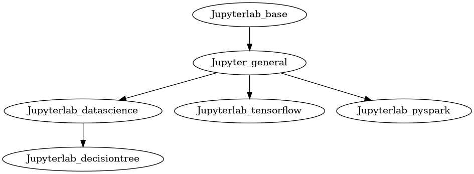
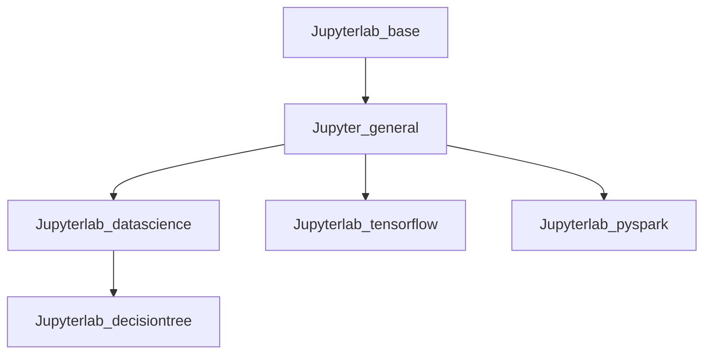

Docker-Stacks
===
## Table of Contents
- [Docker-Stacks](#Docker-Stacks)
  - [Table of Contents](#Table-of-Contents)
  - [Images Dependency](#Inages-Dependency)
  - [Images Details](#Images-Details)

## Images Dependency

Images Details
---

|  Image name             | Install Packages                                                             |
|  ----                   | ----                                                                         |
| Jupyterlab_base         | Jupyterlab git extension,   Mssql driver, Pyodbc,   Pyarrow,  Turbodbc |
| Jupyterlab_general      | Airflow, BentoML, Pylint                                                     |
| Jupyterlab_datascience  | Julia, R                                                                     |
| Jupyterlab_decisiontree |  Xgboost, Lightgbm,   Tpot, Mlxtend                                       |
| Jupyterlab_tensorflow   | Tensorflow,   Datatransformer,   Modelbricks                           |
| Jupyterlab_pysprak      |  Spark                                                                       |
